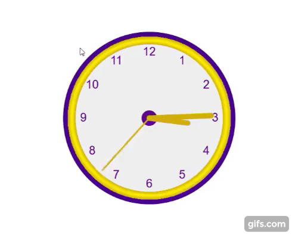

<h1 align="center"> Playground HTML | CSS | JavaScript </h1>

 Repositório de pequenos e simples projetos para praticar, estudar e usar como referências.

  
      

---

Índice:

- [Relógio Canvas ](#relógio-canvas-)
- [Calculadora de IMC ](#calculadora-de-imc-)
  - [👷 Autor](#-autor)
  - [📝 Licença](#-licença)

---

#### 📚 Referências que usei para aprender  

[W3schools](https://www.w3schools.com) -
[MDN Web Docs](https://developer.mozilla.org/pt-BR)

---

## Relógio Canvas 

<a href="https://codepen.io/theslladev/full/RwoqpyW" target="_blank">Veja o funcionando </a>

[Código](https://github.com/ThesllaDev/Simple-Projects/tree/master/Canvas-Clock)

[Mais detalhes](https://github.com/ThesllaDev/Simple-Projects/blob/master/Canvas-Clock/README-CANVAS-CLOCK.md)

---

## Calculadora de IMC 

<a href="https://codepen.io/theslladev/full/RwoqpyW" target="_blank">Veja o funcionando </a>

[Código](https://github.com/ThesllaDev/Simple-Projects/tree/master/Calculadora-de-IMC)

[Mais detalhes](https://github.com/ThesllaDev/Simple-Projects/blob/master/Calculadora-de-IMC/README-CALCULADORA-DE-IMC.md)

---

### 👷 Autor

<a href="https://github.com/ThesllaDev">
 
  
 <b>Thalles Augusto</b></a>

Feito com ❤️ por Thalles Augusto 👋🏽 Entre em contato!  
  

---

### 📝 Licença

Este projeto esta sobe a licença [MIT](./LICENSE).
