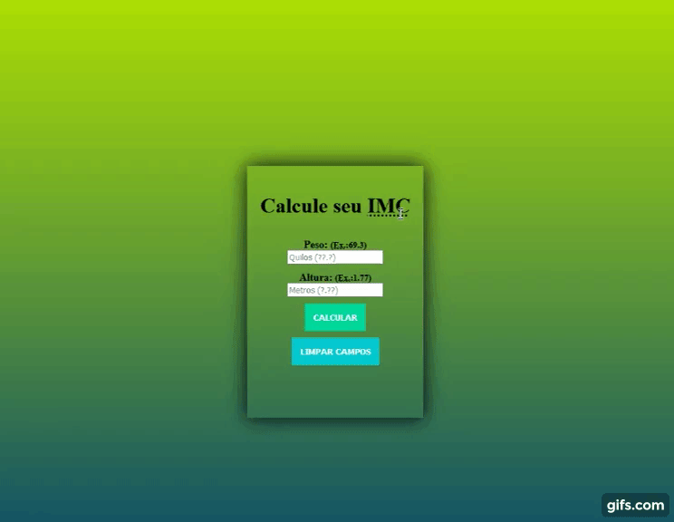
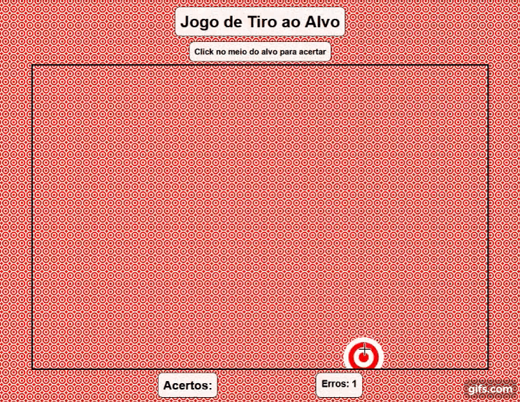
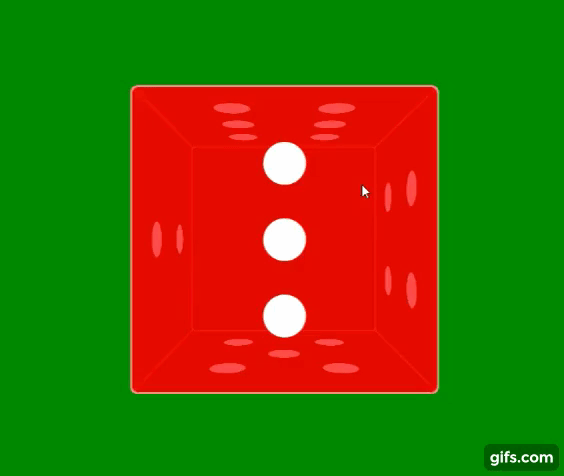
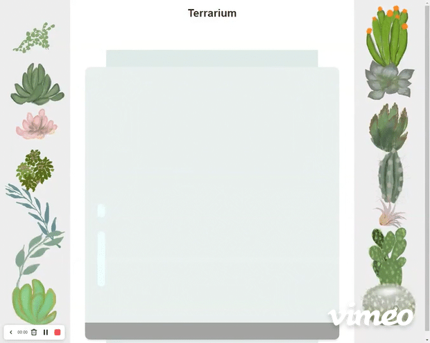
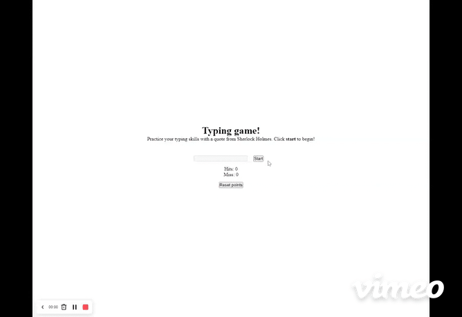

<h1 align="center"> Playground HTML | CSS | JavaScript </h1>

 Repositório de vários projetos simples feitos para praticar, estudar e usar como referências.

<h3>Algumas das tecnologias utilizadas no processo</h3>
  
      

---

#### 📚 Conteúdos e referências que usei para aprender  

[W3schools](https://www.w3schools.com) -
[MDN Web Docs](https://developer.mozilla.org/pt-BR) - [Livro Lógica de Programação](https://www.casadocodigo.com.br/products/livro-programacao) - [ImersãoDev](https://imersao.dev/) - [Microsoft - Web Dev for Beginners](https://github.com/microsoft/Web-Dev-For-Beginners)

---

Índice:

- [Calculadora de IMC ](#calculadora-de-imc-)
- [Certificard ](#certificard-)
- [Conversor de Ano-Luz ](#conversor-de-ano-luz-)
- [Evolua o Pokémon ](#evolua-o-pokémon-)
- [Jogo de Adivinhação ](#jogo-de-adivinhação-)
- [Jogo de Super Trunfo com Personagens da Marvel ](#jogo-de-super-trunfo-com-personagens-da-marvel-)
- [Jogo de Tiro ao Alvo ](#jogo-de-tiro-ao-alvo-)
- [Lista de Filmes ](#lista-de-filmes-)
- [Relógio Canvas ](#relógio-canvas-)
- [Rolagem de dados ](#rolagem-de-dados-)
- [Tabela de Classificação da NBA ](#tabela-de-classificação-da-nba-)
- [Terrarium ](#terrarium-)
- [Typing Game ](#typing-game-)
  - [👷 Autor](#-autor)
  - [📝 Licença](#-licença)

Veja também meu [CODEPEN](https://codepen.io/theslladev/pens/) com vários outros projetos

---

## Calculadora de IMC 

**<a href="https://codepen.io/theslladev/full/yLVGBex" target="_blank">Veja o funcionando </a> |
[Código](https://github.com/ThesllaDev/Simple-Projects/tree/main/Calculadora-de-IMC) |
[Mais detalhes](https://github.com/ThesllaDev/Simple-Projects/blob/main/Calculadora-de-IMC/README-CALCULADORA-DE-IMC.md)**

---

## Certificard 

**<a href="https://codepen.io/theslladev/full/MWJoMGd" target="_blank">Veja o funcionando </a> |
[Código](https://github.com/ThesllaDev/Simple-Projects/blob/main/Certificard) |
[Mais detalhes](https://github.com/ThesllaDev/Simple-Projects/blob/main/Certificard/README-CERTIFICARD.md)**

---

## Conversor de Ano-Luz 

**<a href="https://codepen.io/theslladev/full/XWpbrNo" target="_blank">Veja o funcionando </a> | 
[Código](https://github.com/ThesllaDev/Simple-Projects/tree/main/Conversor-da-Velocidade-da-Luz) | 
[Mais detalhes](https://github.com/ThesllaDev/Simple-Projects/tree/main/Conversor-da-Velocidade-da-Luz/README-CONVERSOR-DE-ANOS-LUZ.md)**

---

## Evolua o Pokémon 

**<a href="https://codepen.io/theslladev/full/JjEYLNY" target="_blank">Veja o funcionando </a> | 
[Código](https://github.com/ThesllaDev/Simple-Projects/tree/main/Evolua-o-Pokemon) | 
[Mais detalhes](https://github.com/ThesllaDev/Simple-Projects/tree/main/Evolua-o-Pokemon/README-EVOLUA-O-POKEMON.md)**

---

## Jogo de Adivinhação 

**<a href="https://codepen.io/theslladev/full/qBRbEwY" target="_blank">Veja o funcionando </a> | 
[Código](https://github.com/ThesllaDev/Simple-Projects/tree/main/Jogo-de-Advinhacao) | 
[Mais detalhes](https://github.com/ThesllaDev/Simple-Projects/tree/main/Jogo-de-Advinhacao/README-JOGO-DE-ADVINHACAO.md)**

---

## Jogo de Super Trunfo com Personagens da Marvel 

**<a href="https://codepen.io/theslladev/full/ExZZQaB" target="_blank">Veja o funcionando </a> | 
[Código](https://github.com/ThesllaDev/Simple-Projects/tree/main/Jogo-Super-Trunfo-Marvel) | 
[Mais detalhes](https://github.com/ThesllaDev/Simple-Projects/blob/main/Jogo-Super-Trunfo-Marvel/README-JOGO-SUPER-TRUNFO-MARVEL.md)**

---

## Jogo de Tiro ao Alvo 

**<a href="https://codepen.io/theslladev/full/BapBvbw" target="_blank">Veja o funcionando </a> | 
[Código](https://github.com/ThesllaDev/Simple-Projects/tree/main/Jogo-de-Tiro-ao-Alvo) | 
[Mais detalhes](https://github.com/ThesllaDev/Simple-Projects/tree/main/Jogo-de-Tiro-ao-Alvo/README-JOGO-DE-TIRO-AO-ALVO.md)**

---

## Lista de Filmes 

**<a href="https://codepen.io/theslladev/full/eYgZKXy" target="_blank">Veja o funcionando </a> | 
[Código](https://github.com/ThesllaDev/Simple-Projects/tree/main/Lista-de-Filmes) | 
[Mais detalhes](https://github.com/ThesllaDev/Simple-Projects/tree/main/Lista-de-Filmes/README-LISTA-DE-FILMES.md)**

---

## Relógio Canvas 

**<a href="https://codepen.io/theslladev/full/RwoqpyW" target="_blank">Veja o funcionando </a> | 
[Código](https://github.com/ThesllaDev/Simple-Projects/blob/main/Relogio-Canvas) | 
[Mais detalhes](https://github.com/ThesllaDev/Simple-Projects/blob/main/Relogio-Canvas/README-RELOGIO-CANVAS.md)**

---

## Rolagem de dados 

**<a href="https://codepen.io/theslladev/full/NWbZabZ" target="_blank">Veja o funcionando </a> | 
[Código](https://github.com/ThesllaDev/Simple-Projects/blob/main/Rolagem-de-Dados) | 
[Mais detalhes](https://github.com/ThesllaDev/Simple-Projects/blob/main/Rolagem-de-Dados/README-ROLAGEM-DE-DADOS.md)**

---

## Tabela de Classificação da NBA 

**<a href="https://codepen.io/theslladev/full/XWpjYxp" target="_blank">Veja o funcionando </a> | 
[Código](https://github.com/ThesllaDev/Simple-Projects/tree/main/Tabela-de-Classificacao) | 
[Mais detalhes](https://github.com/ThesllaDev/Simple-Projects/tree/main/Tabela-de-Classificacao/README-TABELA-DE-CLASSIFICACAO.md)**

---

## Terrarium 

**<a href="https://codepen.io/theslladev/full/yLMoZmd" target="_blank">Veja o funcionando </a> | 
[Código](https://github.com/ThesllaDev/Simple-Projects/tree/main/Terrarium) | 
[Mais detalhes](https://github.com/ThesllaDev/Simple-Projects/blob/main/Terrarium/README-TERRARIUM.md)**

---

## Typing Game 

**<a href="https://codepen.io/theslladev/full/oNZJMzj" target="_blank">Veja o funcionando </a> | 
[Código](https://github.com/ThesllaDev/Simple-Projects/tree/main/Typing-Game) | 
[Mais detalhes](https://github.com/ThesllaDev/Simple-Projects/blob/main/Typing-Game/README-TYPING-GAME.md)**

---

### 👷 Autor

<a href="https://github.com/ThesllaDev">
 
  
 <b>Thalles Augusto</b></a>

Feito com ❤️ por Thalles Augusto 👋🏽 Entre em contato!  
  

---

### 📝 Licença

Este projeto esta sobe a licença [MIT](./LICENSE).
